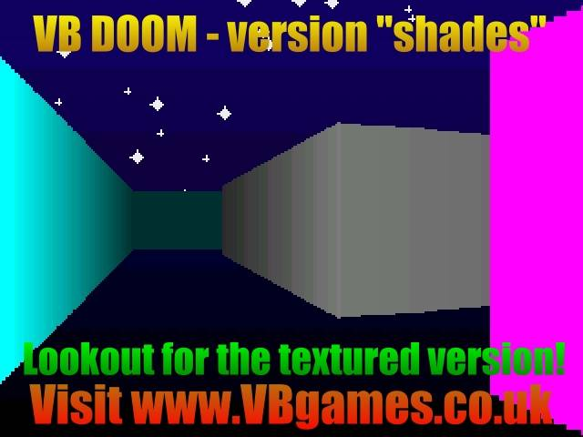



## aMAZEing 3D shading

### Description

aMAZEing shading is a 3D Doom-style game. It has nice depth cueing rendering on the polygons, plus some twinkling stars in the backround as a bonus. If you thought that 3D couldn't be achieved real-time in VB, think again. And if you thought this was good, wrong again. I have two other versions of the game (one uses DX7, the other is pure VB) both of which have cool perspective textured mapped graphics (pictures on the walls!) both available on the website. They are far better than this, go look at them. This was just a fun experiment with the original program, to keep those waiting for the final version [which will have floor, ceiling and monsters soon] happy for a while. I'd like to emphasise that this version [and the final one] does NOT use DirectX, or any DLL's or ocx's which were written in faster programming languages. This has so far and will continue to be achieved in pure VB code to prove that it's possible to make a 3D texture mapped game in pure VB code. NOTE : please DO NOT vote for this game (!), please vote for my original aMAZEing 3D game instead [although I have no objection if you'd like to vote for both!]
 
### More Info
 

             |
---                |---
**Submitted On**   |2000-06-29 22:19:38
**By**             |[Simon Price](https://github.com/Planet-Source-Code/PSCIndex/blob/master/ByAuthor/simon-price.md)
**Level**          |Intermediate
**User Rating**    |5.0 (30 globes from 6 users)
**Compatibility**  |VB 3\.0, VB 4\.0 \(16\-bit\), VB 4\.0 \(32\-bit\), VB 5\.0, VB 6\.0, VB Script, ASP \(Active Server Pages\) 
**Category**       |[DirectX](https://github.com/Planet-Source-Code/PSCIndex/blob/master/ByCategory/directx__1-44.md)
**World**          |[Visual Basic](https://github.com/Planet-Source-Code/PSCIndex/blob/master/ByWorld/visual-basic.md)
**Archive File**   |[CODE\_UPLOAD72936292000\.zip](https://github.com/Planet-Source-Code/simon-price-amazeing-3d-shading__1-9390/archive/master.zip)

